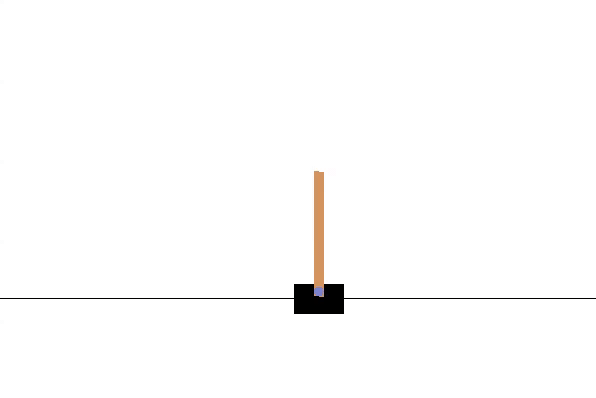

# Classic-Control
Using Deep Q Learning to solve control theory problems from classic RL literature (and figure out how to land a spaceship).
## Notes
1. All environments (CartPole-v0 and MountainCar-v0, LunarLander-v2) have been sourced from OpenAI's Gym API (https://gym.openai.com). 
2. Q Learning was facilitated through use of two artifical neural networks (a Q Net and a Target Net). The functions of both networks are layed out in this article: https://towardsdatascience.com/self-learning-ai-agents-part-i-markov-decision-processes-baf6b8fc4c5f.
3. Testing figures are drawn from model parameters found in the __models__ folder of each environment (these parameters were collected following training).

# CartPole (CartPole-v0)
The agent in this problem is tasked to keep a pole balance on a cart.<br/><br/>
**Hyperparameters**:
* learning rate = 0.01
* gamma = 0.99
* batch size = 64
* memory size = 1000
* epsilon = 1.0
* epsilon decay rate = 0.9
* target net update frequency = 200 (timesteps) <br/>

**Agent after training:**<br/>


**Results:**
+ First successful episode: 185
+ Total episodes: 1000
+ Desired reward: 200.0
+ Average reward during testing (100 episodes): 200.0

# MountainCar (MountainCar-v0)
The agent in this problem is a car tasked with making its way to a flag perched on a hill. The car cannot force its way up the hill and, thus, must learn the generate the momentum required to do so. <br/><br/>
**Hyperparameters**:
* learning rate = 0.0001
* gamma = 0.99
* batch size = 64
* memory size = 100000
* epsilon = 1.0
* epsilon decay rate = 0.9
* target net update frequency = 200 (timesteps) <br/>

**Agent after training:**<br/>


**Results:**
+ First successful episode: 1042
+ Total episodes: 1500
+ Desired reward: >= -100
+ Average reward during testing (100 episodes): -147.1 (successful roughly 3/5th of the time) 

# LunarLander (LunarLander-v2) 
A spaceship (the agent) is tasked with softly landing on a marked landing strip. Landing too fast results in a travestyand landing too slow is a waste of gas. <br/><br/>
**Hyperparameters**:
* learning rate = 0.0001
* gamma = 0.99
* batch size = 64
* memory size = 5000
* epsilon = 1.0
* epsilon decay rate = 0.9
* target net update frequency = 200 (timesteps) <br/>

**Agent after training:**<br/>


**Results:**
+ First successful episode: 1592
+ Total episodes: 2000
+ Desired reward: >= 200 (according to the documentation: https://github.com/svpino/lunar-lander/)
+ Average reward during testing (100 episodes): 57.4 


## Play around with it!
**Requirements**:<br/>
```bash
pip3 install gym
pip3 install numpy
pip3 install torch
```

**Clone the repo**:<br/>
```bash
git clone https://github.com/DevinLeamy/Classic-Control.git
```

**Train an agent (MountainCar in this example)**:<br/>
```bash
cd MountainCar
python3 train.py
```

**Test your agent**:<br/>
```bash
python3 test.py
```

## Improvements
Promising ways to improve the success of the agents:
- **Tune hyperparameters** (the hyperparameters used are likely not optimal)
- **Conduct more training** (agents were trained until they reached a preset threshold to save compute; train the agents until results reach a desired consistency)
- **Modify reward function** (LunarLander and MountainCar utilize their environments' default reward function which is likely not optimal)
